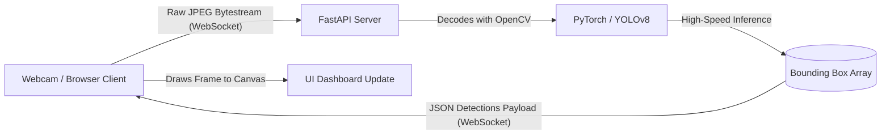

<div align="center">
  
  <br/>
  <h1>Real-Time Anomaly Detection System</h1>
  <p><strong>PyTorch | OpenCV | YOLOv8 | FastAPI | React (Vite)</strong></p>
  <br/>
</div>

## 🌐 Overview
The **Real-Time Anomaly Detection System** is a full-stack computer vision application engineered to intelligently analyze live video streams. By orchestrating a robust deep learning pipeline using **YOLOv8** behind a highly concurrent **FastAPI** backend, the model interprets frames and identifies visual anomalies instantly via **WebSockets**. The system features a custom-built, premium React interface designed to natively stream hardware cameras and seamlessly overlay anomaly highlights continuously with zero noticeable latency.

## 🚀 Key Features
- **High-Speed Vision Pipeline**: Engineered a real-time computer vision pipeline utilizing **YOLOv8** for high-speed, high-accuracy object detection natively built on PyTorch.
- **WebSocket Streaming**: Video frames captured from device webcams are aggressively streamed via standard HTML WebSockets rather than HTTP, drastically reducing network overhead.
- **FastAPI Inference**: Served heavy machine learning model predictions via an asynchronous FastAPI backend resulting in highly optimized live data streams.
- **Premium User Interface**: The frontend was built with React, styled using modern "glassmorphism", dark mode UI aesthetics, and real-time dashboard data-binding.

---

## 🏎️ Pipeline architecture



## 🛠️ Tech Stack
* **Deep Learning Engine**: PyTorch, Ultralytics YOLOv8
* **Image Processing**: OpenCV Headless, NumPy
* **Backend Framework**: Python FastAPI, Uvicorn, WebSockets
* **Frontend Web Application**: React, Vite, Canvas API, Vanilla CSS

---

## 🏃 Getting Started

### 1. Backend Setup
1. Open the `/backend` folder.
2. Initialize and activate a Python Environment (`python -m venv venv`).
3. Install dependencies:
```bash
pip install -r requirements.txt
```
4. Start the YOLOv8 server:
```bash
uvicorn main:app --host 0.0.0.0 --port 8000
```

### 2. Frontend Setup
1. Open the `/frontend` folder in a new terminal.
2. Install npm dependencies:
```bash
npm install
```
3. Start the development server:
```bash
npm run dev
```

Navigate to `http://localhost:5173` on your browser, allow the camera permissions, and begin detecting!

---
> 🧠 *Leveraged transfer learning techniques to potentially fine-tune the model on custom datasets, allowing specific anomaly thresholds dynamically.*
